

<h1>新月国际服</h1>
<h4>文档与服务器内玩法、技术细节相关。</h4>
<h4>新玩家请务必阅读以下内容。游戏时遇到其他任何问题，都可在本文档内查阅搜索。</h4>
<!--<a herf="https://www.minebbs.com/resources/dls-bds.2269/"><b>MineBBS发布页</b><a>　｜　<a herf="https://gitee.com/dlcn/dlscq/wikis/"><b>项目wiki</b><a>-->

  

> [!WARNING]
> 服务器里有任何通知都会发到群公告里，**请务必看群公告！！！**  
> 遇到问题的时候，在看文档之前，先把服务器历史公告全都看一遍。文档只有操作方法，所有的通知都不会在文档更新，都会发到群公告
> 我们的群公告即使没有置顶也是十分重要的！

> [!NOTE]
> 本网站通过工具[docsify](https://github.com/docsifyjs/docsify)生成。要搜索内容，只需要在左侧的侧边栏顶部的搜索框中输入关键词即可。如果没有显示侧边栏，请点击网页左下角的“三”，即可展开侧边栏。

> [!NOTE]
> **关于ZBC三服的相关说明**
> 本服已与ZBC服务器达成合作，在ZBC服务器审核中满足特定条件的玩家即可来到本服游戏。本服务器与ZBC服务器无从属关系，由独立的两个团队运营，服务器的内容也无互相关联。

# 开始游戏
> [!TIP]
> 能来玩国际版，就要锻炼自行解决问题的能力，国际版玩家少，国内没有官方支持，操作与国内软件常用步骤差别较大，在遇到问题时，善用百度、必应，谷歌等搜索引擎，准备合适的代理软件访问境外网站，阅读教程时，思考其中的操作逻辑，记下各个教程的相同点，在遇到没有详细说明某些步骤的教程时，根据之前的经验自行尝试。使用教程文档时，善用网页及浏览器的搜索功能。实在找不到教程时，与其他人友善交流，提问时尽可能详细地说明自己如何操作才造成了这个问题。

## Java版服务器
### 下载安装游戏
根据自己正在使用的操作系统，查看下方提供的对应教程
#### [Windows](b23.tv/BV1Xe4y1X7G7)
**如果不知道自己的电脑是什么系统，那只要不是苹果电脑就直接看这个**  

#### [macOS（苹果电脑）](b23.tv/BV1tj411z7xa)

#### [安卓](b23.tv/BV1N94y1k7AN)

#### iOS（苹果手机）
- [iOS16及以下](b23.tv/BV1Yx4y1X7UR)
- [iOS17及以上](b23.tv/BV164421U7AN)

### 进入服务器
0. 如果你的界面是英文，而且你看不懂，那么点击主界面左下角**Options...**，然后点击**Language...**，然后往下翻就能找到**简体中文**了，点击之后别忘了点右下角的完成，游戏显示MOJANG的logo才算切换
1. 点击多人游戏
2. 如果弹出全屏提示，直接打勾再点确定
3. 点击添加服务器
4. 服务器名称不用动，服务器地址填入服务器的进服地址即可，比如是server.231l.net:56640，就直接**整个**填进去就行
5. 点击完成
6. 然后直接双击自己刚刚添加好的服务器即可，如果显示**无法连接至服务器**证明地址那栏填的不对

## 基岩版服务器

### [下载游戏](download)

### 进入服务器
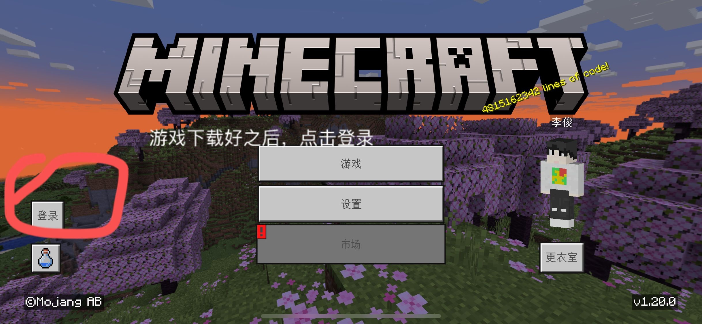  
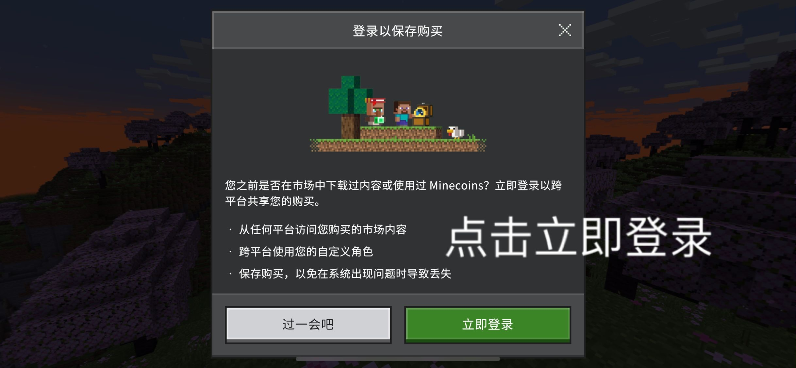  
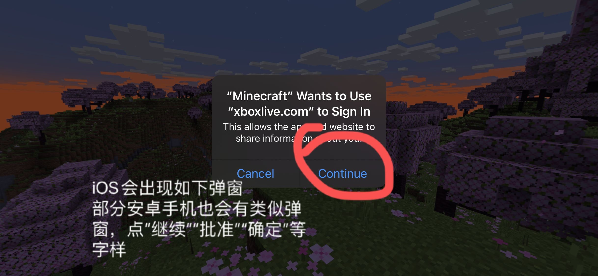  
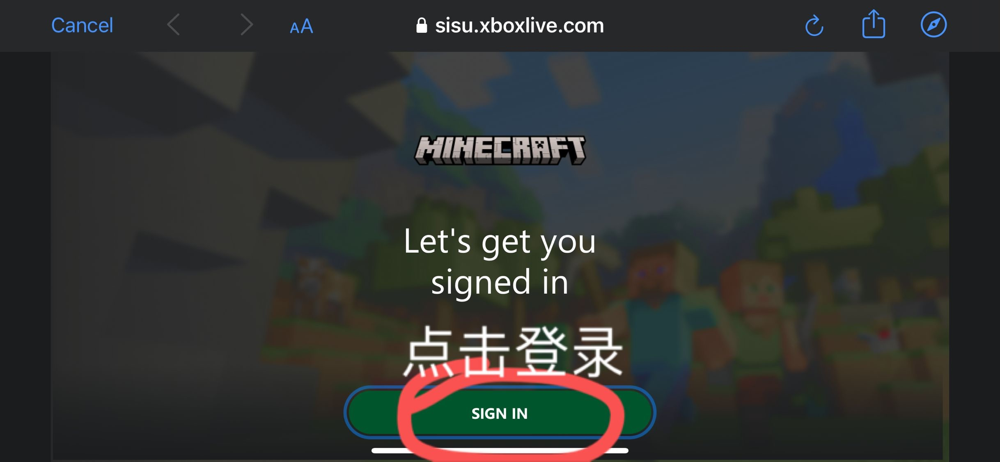  
注册/登录你的微软帐号，此步骤暂无截图  
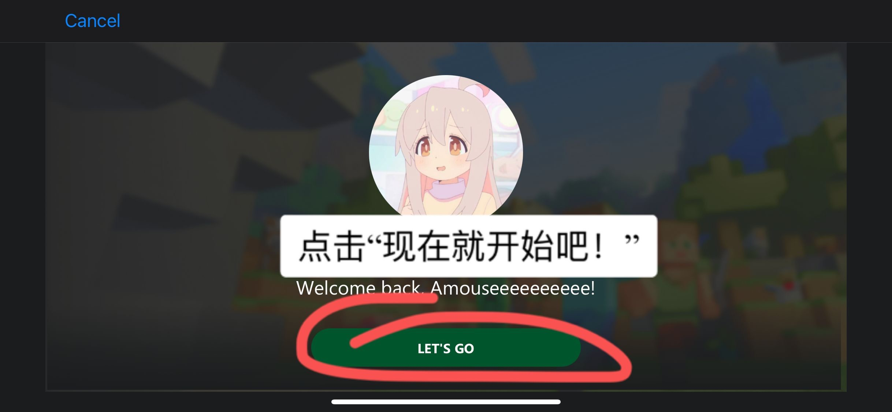  
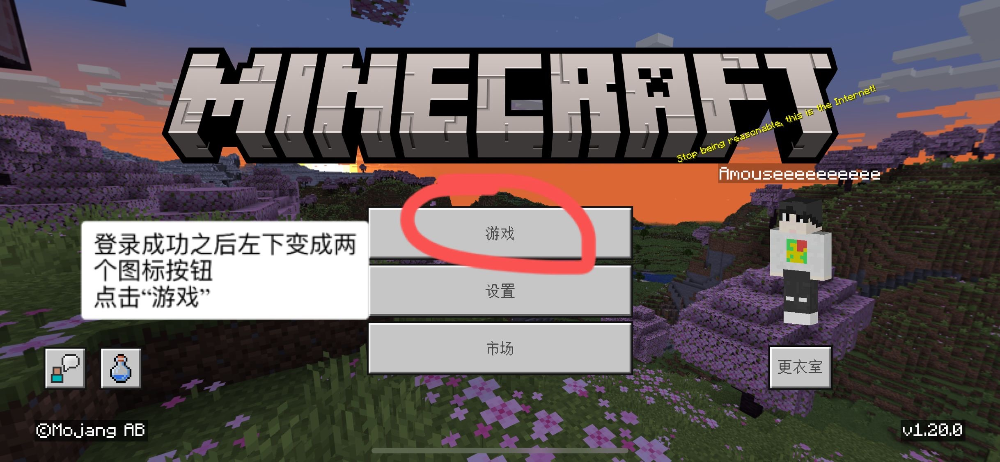  
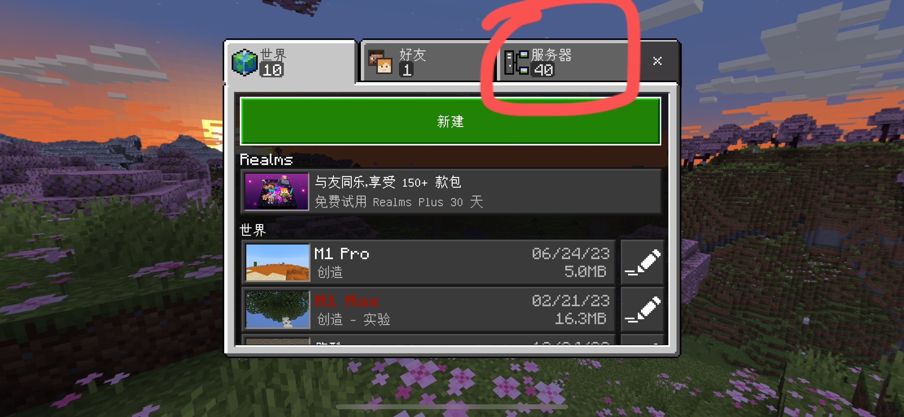  
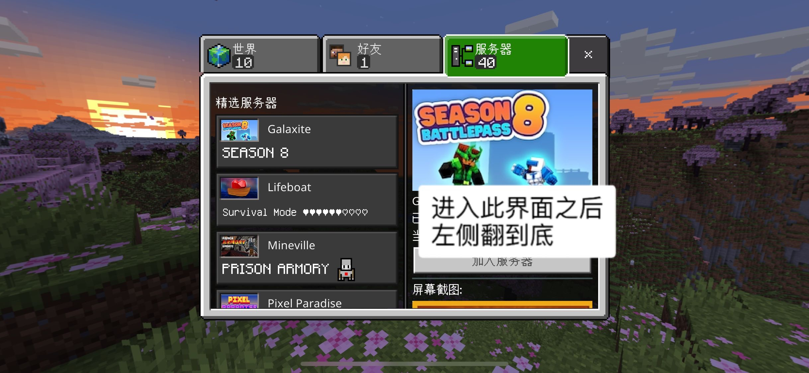  
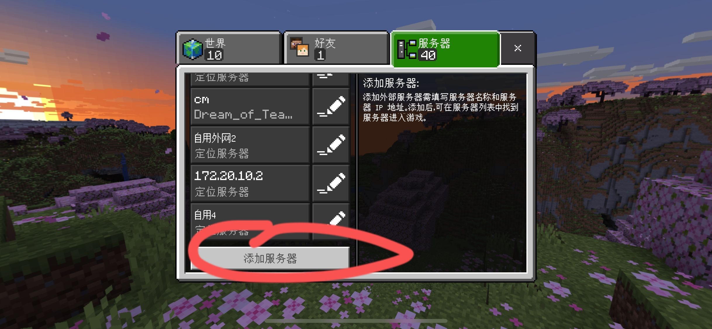  
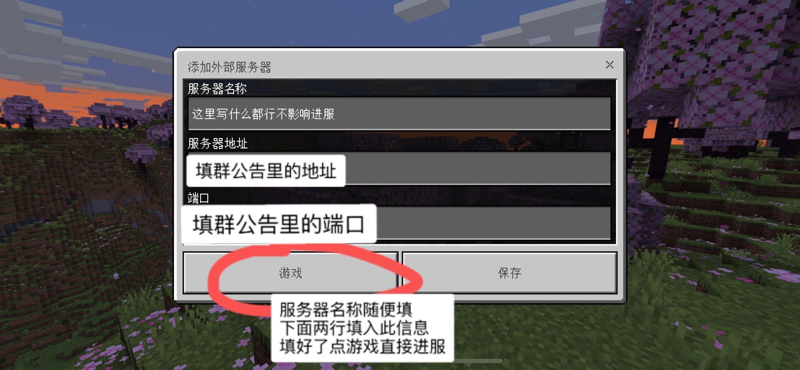  
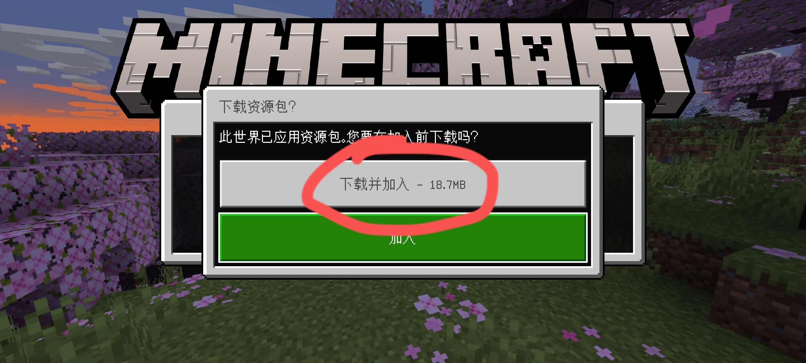  
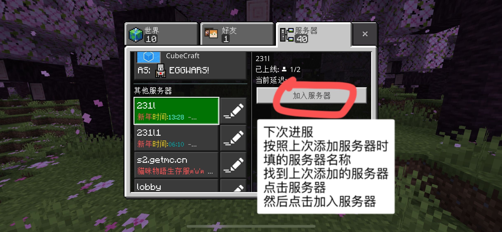  
如果按照以上步骤操作之后无法连接至服务器，请阅读[无法进入服务器](cannotconnect)  
成功进入服务器后，如果对服务器里的各功能有疑惑，请先在该文档左上角输入你要搜索的关键词。
