# 官网弹窗无法连接至服务器，请进入这个网页

### 遇到此弹窗，先刷新网站

### 如果刷新之后又秒弹窗，就点击那个网页的链接，跳转过去

### 如果打不开，先关闭自己设备上所有的代理软件（梯子、游戏加速器），然后再试一次

如果提示501，证明你不是点击了网站上的链接跳转过去的，请回到我们官网，等弹窗，弹窗之后再点击链接跳转

如果确认了所有代理软件都已经关闭，证明服务器那边确实是有问题，联系服务器管理员

### 跳转后，提示“您的连接不是私密连接”，“安全警告”，“安全连接失败”，“安全证书不可信”

这是最关键的一步，根据你使用的浏览器，按照以下步骤操作

  
点击阅读谷歌浏览器、安卓手机自带浏览器等 Chromium 内核浏览器操作方法

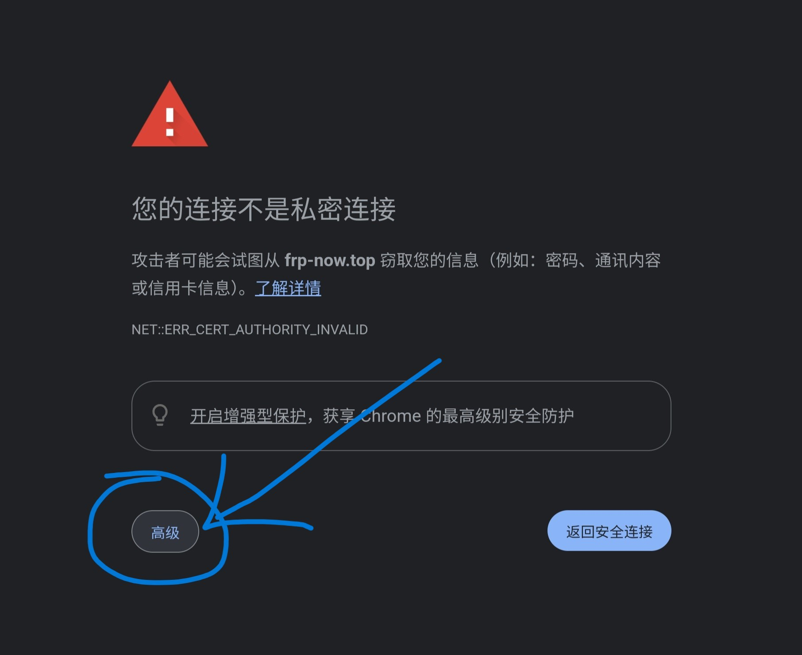

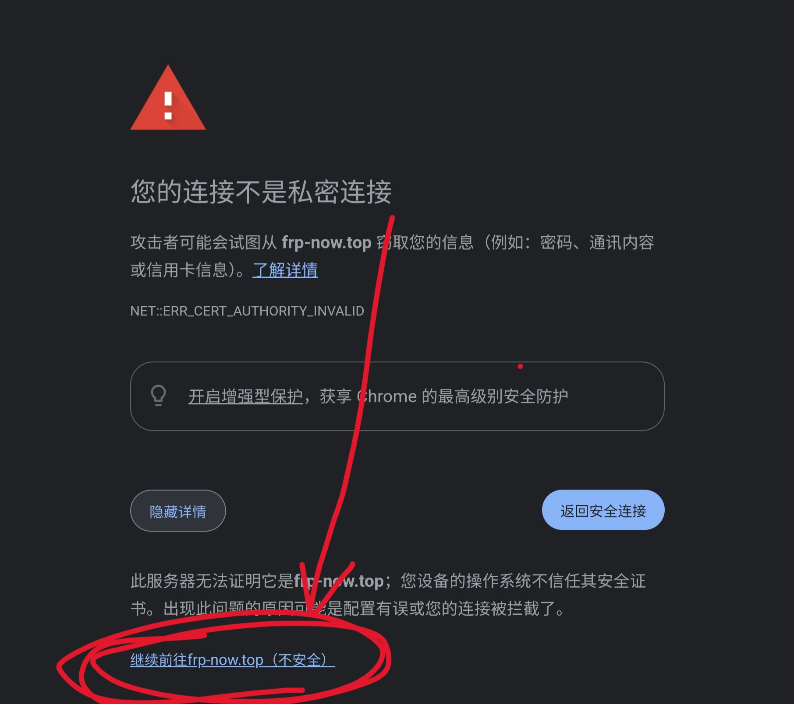

  
点击阅读Windows电脑自带浏览器Edge操作方法

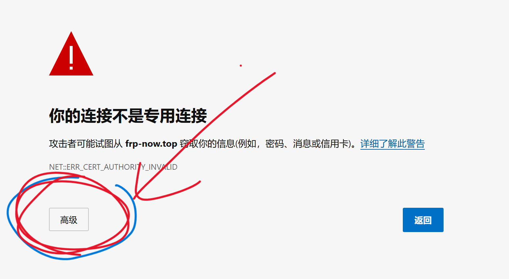

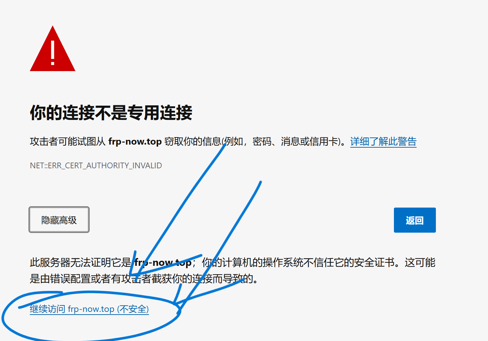

  
点击阅读苹果手机苹果电脑电脑自带浏览器Safari操作方法

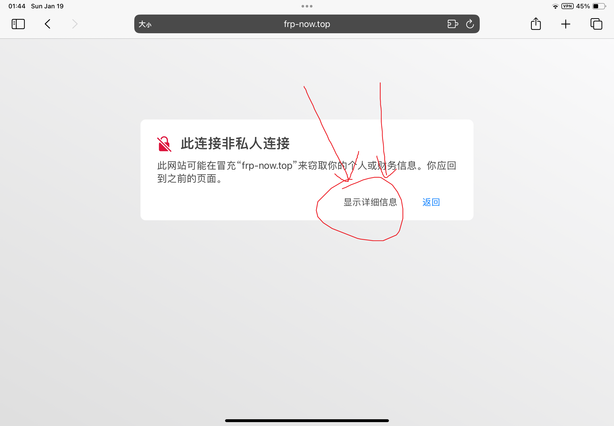

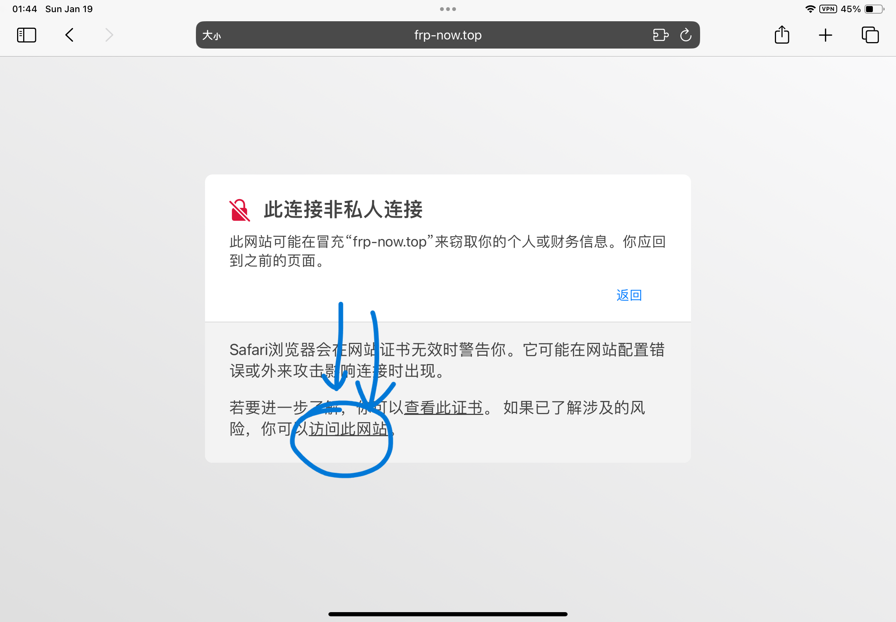

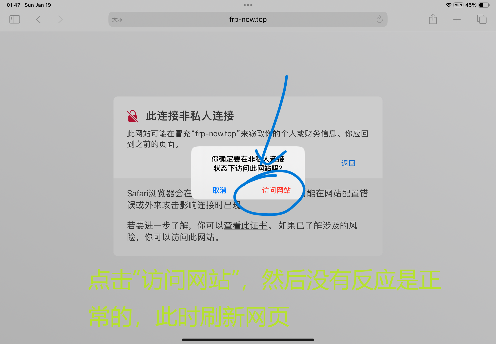

#### 出现此字样代表设置成功

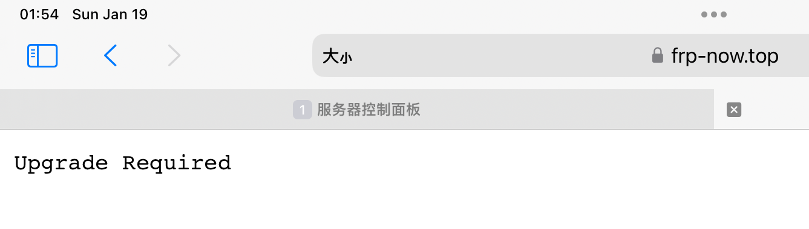

  
点击阅读华为手机自带浏览器操作方法

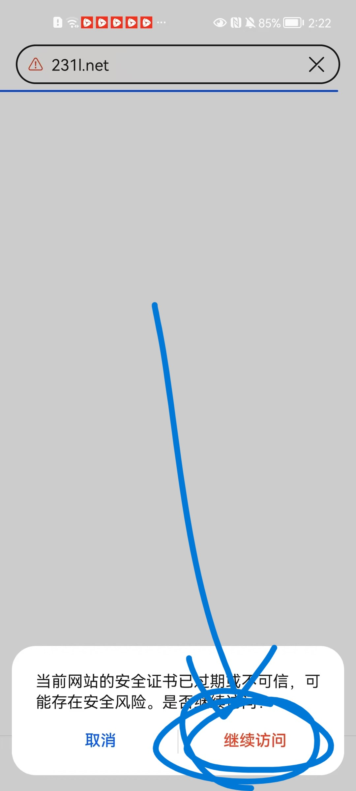

#### 出现此字样代表设置成功

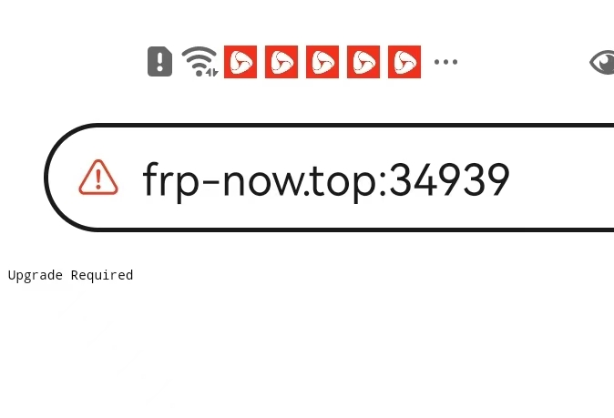

  
点击阅读手机百度操作方法

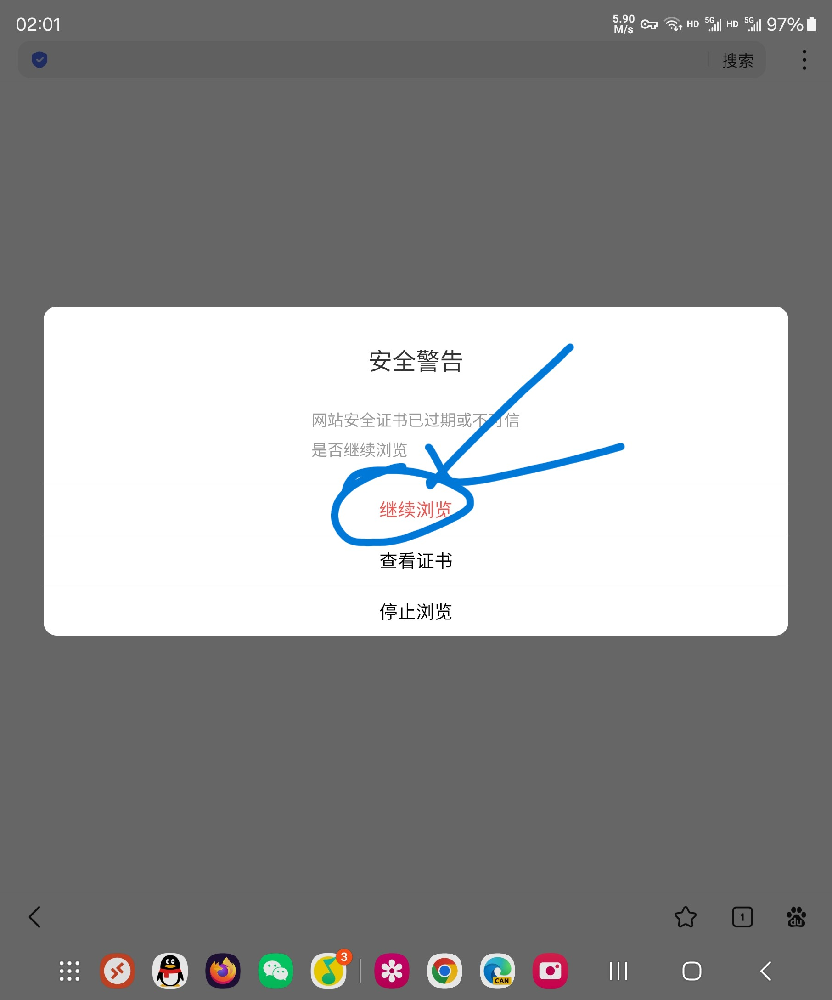

  
点击阅读夸克浏览器操作方法

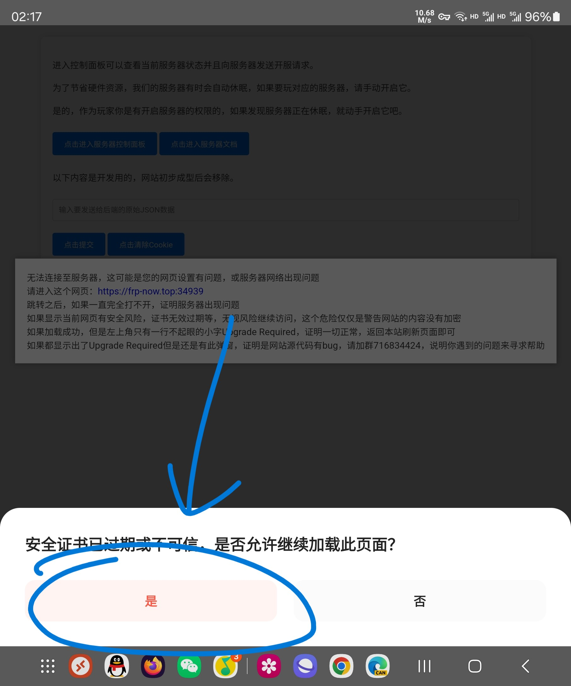

#### 出现此字样代表设置成功

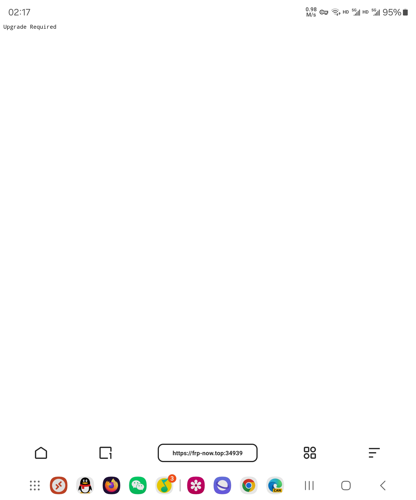

  
点击阅读Linux系统自带浏览器火狐浏览器FireFox操作方法

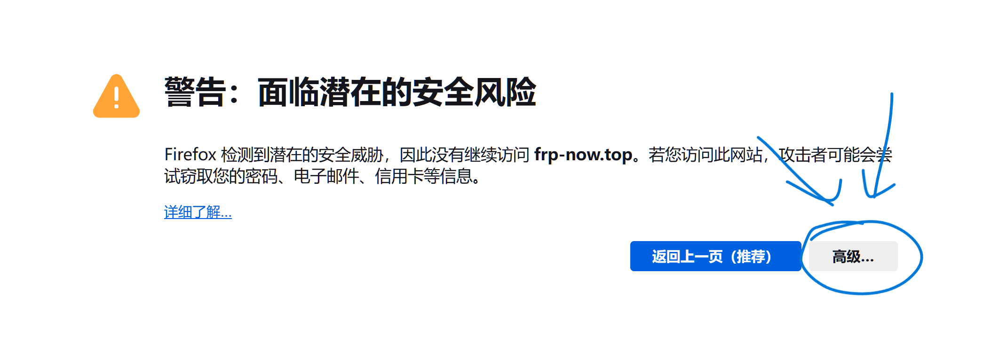

#### 出现此字样代表设置成功

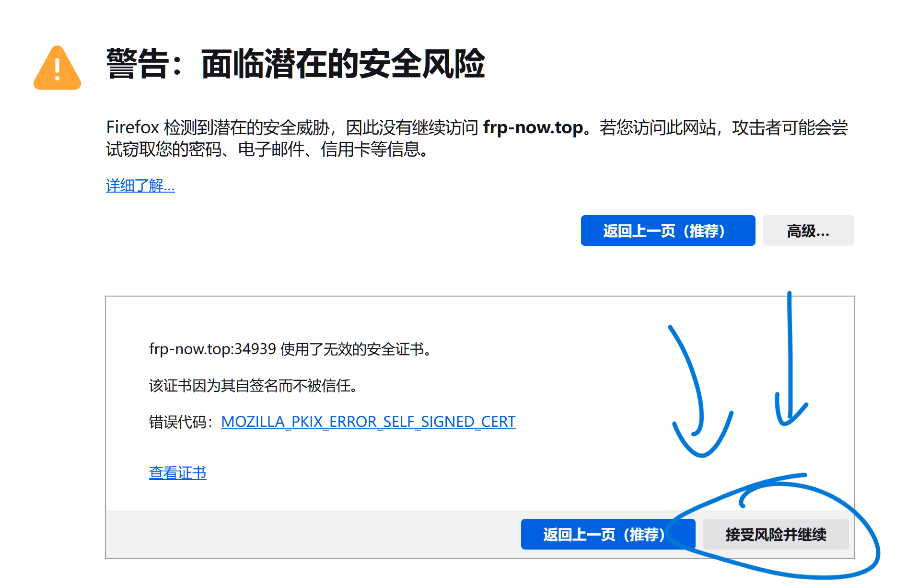

  
点击阅读手机版火狐浏览器操作方法

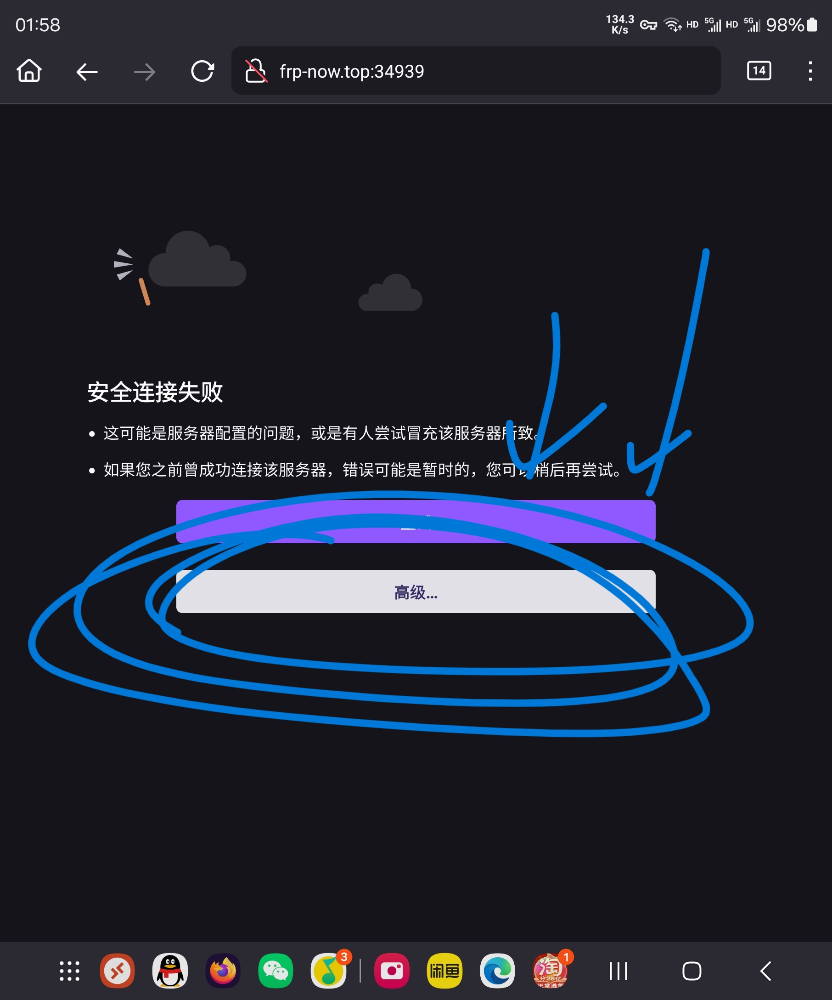

#### 出现此字样代表设置成功

### 跳转后，提示Upgrade Required

#### 出现此字样代表设置成功，现在请回到官网刷新网站

  
十万个为什么：为什么提示Upgrade Required

刚刚无视风险继续访问的步骤是解除对我们服务器API的默认限制

我们的官网为前后端分离形式

我们的服务器采用Websocket（ws）协议提供API服务，而该协议是基于http协议的

我们的官网采用Github Pages提供的免费服务，所以我们的官网不能使用单纯的websocket协议连接服务器，技术上具体因为以下几点原因：

1. Github Pages不能禁用https
2. 最新版本浏览器普遍默认开启https-first，99%的玩家不知道如何关闭
3. 最新版本浏览器普遍默认开启禁止https网站连接普通websocket，只能连接https的websocket（wss），导致一旦通过https访问官网，官网就无法通过普通websocket协议连接服务器API，而且99%玩家不知道如何关闭
4. https-first模式下浏览器永远将http协议改为https协议，如果网站自行将其改回http，就会和浏览器对抗，然后浏览器觉得网站太吵，禁止网站改回http，于是浏览器获胜，网站仍然无法连接服务器
4. 服务器管理团队没有钱或精力为websocket服务配置SSL证书，配置了SSL证书就可以没有上文那个不安全连接的提示
5. 如果直接用服务器的公网搭建官网，不仅运营商封80端口，访问必须带端口号，而且现在上面在查家宽搭建网站，用来公开访问的网站更容易被查
6. 自己买虚拟主机搭建官网虽然可以直接禁用https，但是API方面是必须用服务器自己的公网搭建的，如果用了普通websocket，由于基于http协议，仍然能被上面查到
7. 自己买vps反代服务器的API虽然可行，但是vps太贵了
8. 公共内网穿透运营商内地节点只能用wss协议+自签证书，目前我们用的就是这个方案，所以自签证书导致证书错误，国外和港澳台节点虽然能穿透普通websocket，但是不稳定，内地几乎不可用

未来的两种解决方案：
1. 用梯子加速frp促使海外节点稳定连接，进而换上普通websocket
2. 搞到正经的ssl证书给服务器后端装上

如果都显示出了Upgrade Required但是还是有此弹窗，证明是网站源代码有bug，请加群716834424，说明你遇到的问题来寻求帮助