# 注册

首先你需要为你的游戏ID绑定白名单

目前有三种绑定白名单方式：加群通过QQ号绑定、通过相同基岩版ID绑定（未开放）和通过Java版正版帐号绑定（未开放）

## 什么是游戏ID/游戏名

进入任意一家服务器就可以看到自己的游戏名

你的游戏名就是此处所谓的游戏ID

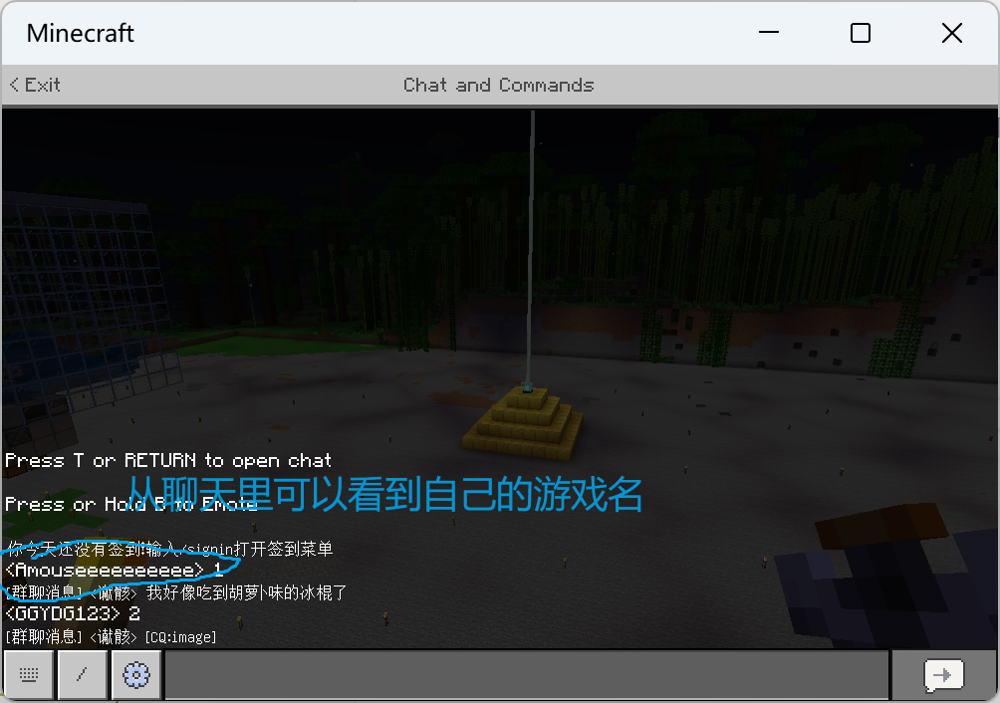
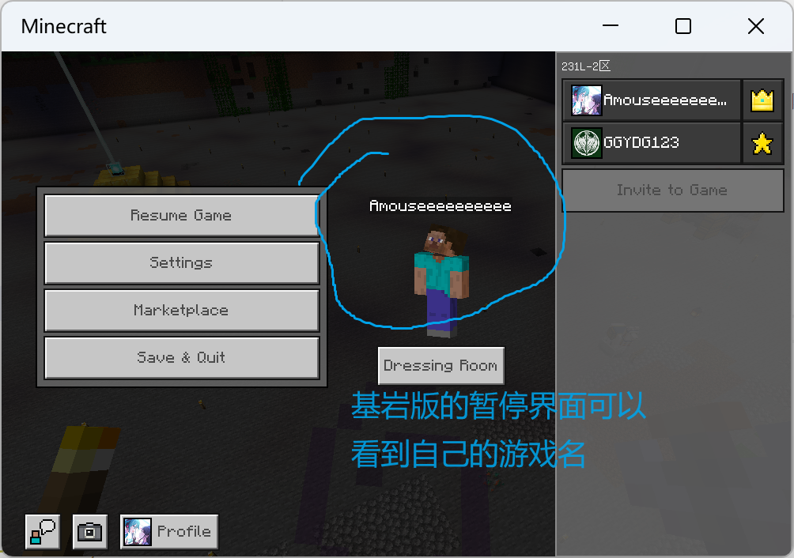
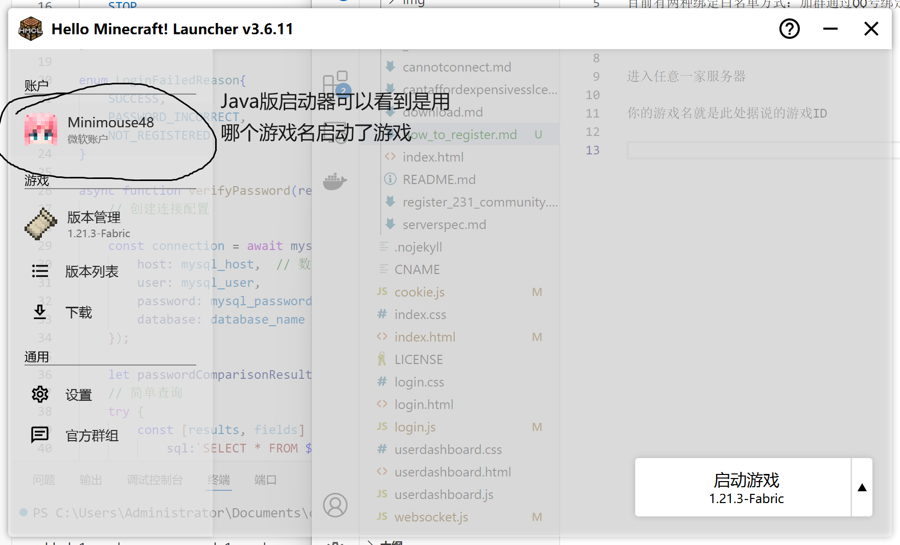
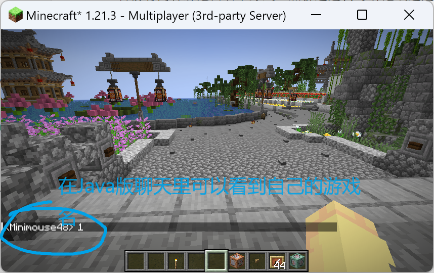
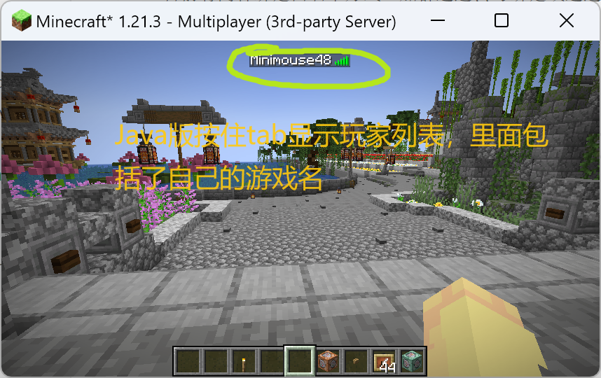

## 如何绑定白名单

### 通过QQ号绑定

首先加入我们的QQ群

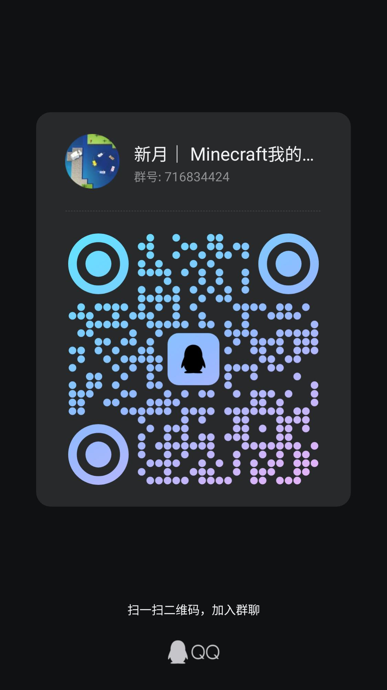

进群之后发送`绑定白名单 <你的游戏ID>`  
例如发送`绑定白名单 Minimouse48`（Minimouse48是我自己的游戏名）

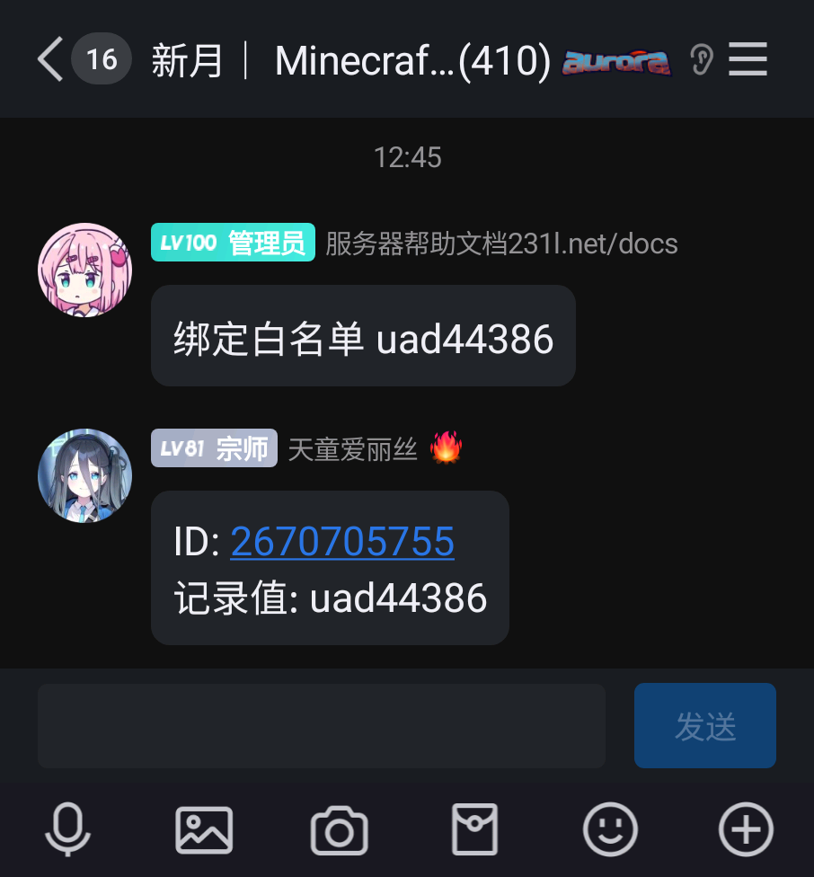

如果机器人没反应，证明可能是机器人封号了或者服务器停机了，如果群里没有公告说机器人被封或者服务器停电，请直接联系群里的服务器管理员

### 通过基岩版绑定（未开放）

### 通过Java版正版帐号绑定（未开放）

## 如何注册

使用Java版1.8+或基岩版最新版，使用刚刚绑定好白名单的游戏名进入服务器主城（主城连接地址和进服详细方法位于[文档首页](README.md)）

进入服务器后，服务器提示你注册

发送`/register <你要设置的密码> <你要设置的密码>`即可注册

前后两个密码相同，也就是重复密码，防止你手滑打错密码导致后续登不上

例如我要设置我的密码为`jeusnc`，就发送`/register jeusnc jeusnc`

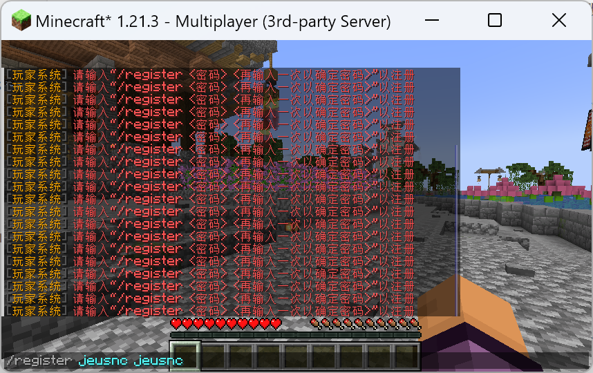

> [!WARNING]
> 请勿使用任何例子中的密码注册，因为这些密码已经公开，无法保证你游戏帐号的安全性  
> 也不要使用`12345678`、`11111111`这类过于简单的密码  
> 建议密码中同时包含大写字母、小写字母、数字和标点符号，这样的密码极难被破解，非常安全  

如果注册成功，有以下提示

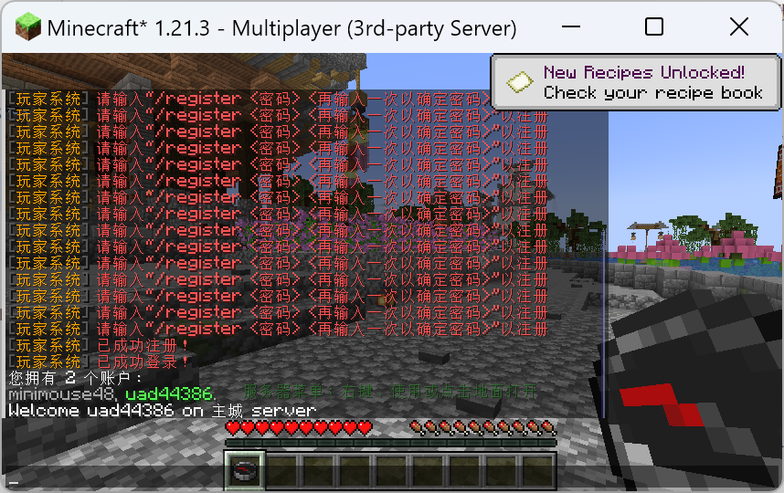

## 如何登录

### 登录官网

在官网的登录界面，输入你的游戏名和在主城设置的密码

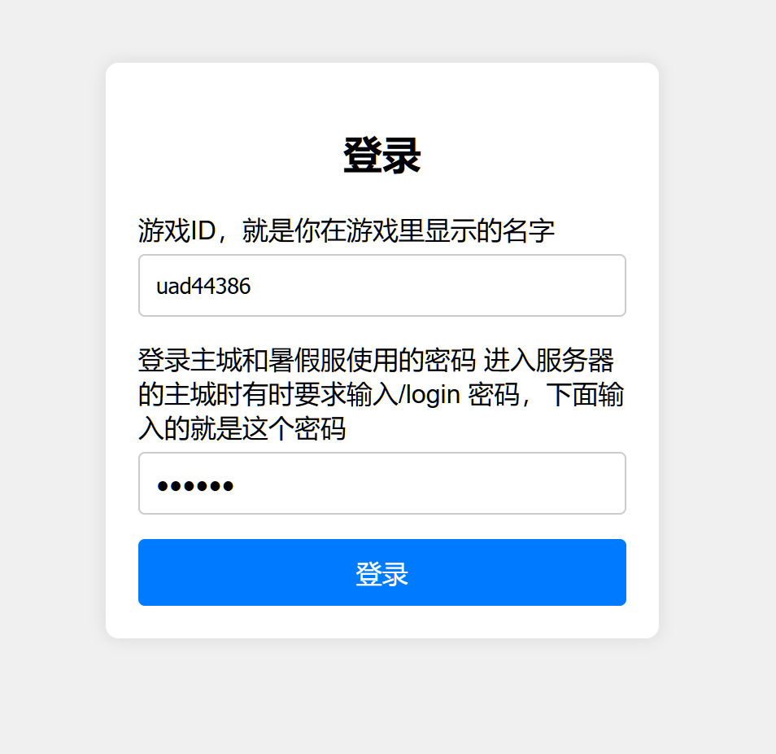

点击登录，如果输入正确，网站会跳转，否则会弹窗告知登录失败原因

### 登录主城

一段时间不登录或更换IP后再次进入主城时，服务器会提示需要登录

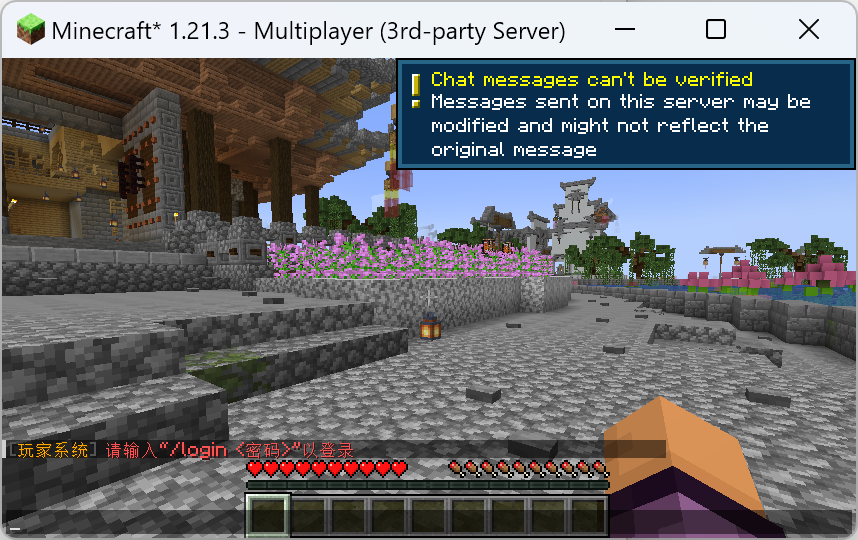

发送`/login <你设置的密码>`即可登录

例如你的密码是`jeusnc`，就执行`/login jeusnc`

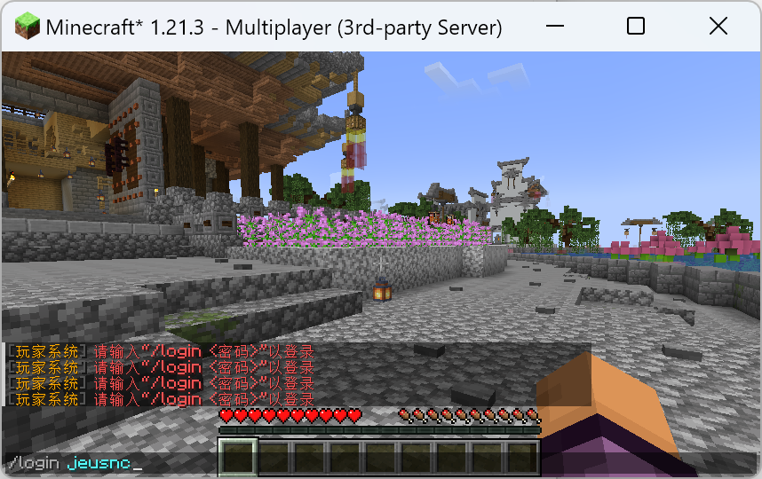

如果输入正确会提示登录成功

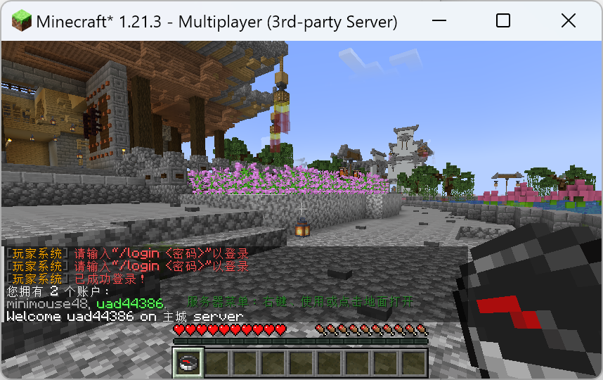

登录失败会被踢出服务器，重新进服再试即可